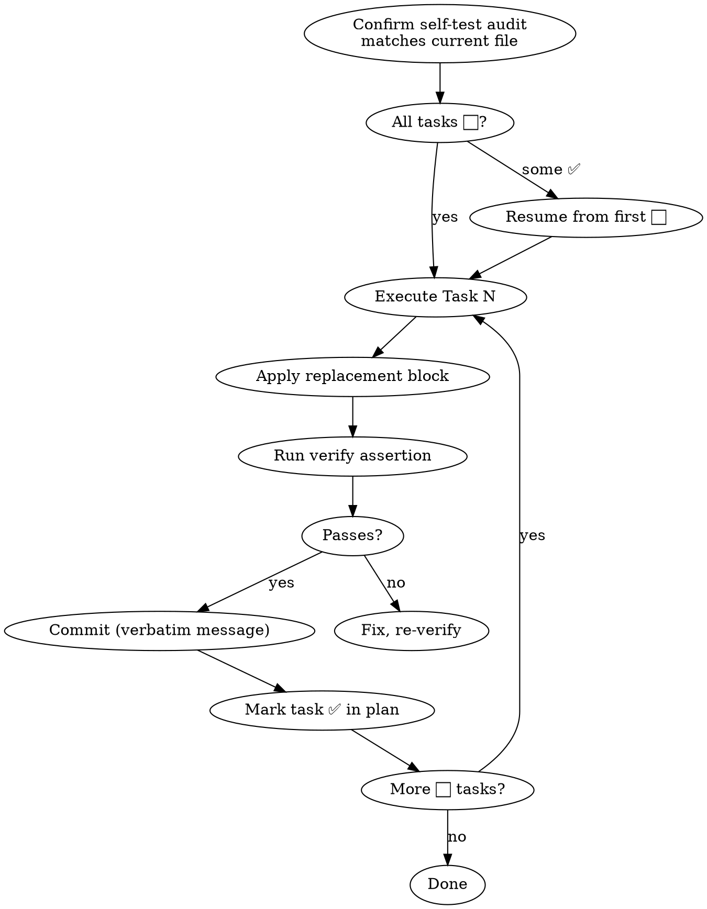

# Plan-Driven File Refactoring

## Overview

This skill enforces a four-phase lifecycle for any file refactor:

```
Profile → Plan → Review → Execute
```

**Profile** the file to understand its structure and pain points.  
**Plan** the refactor as a versioned document with exact replacement blocks.  
**Review** the plan for accuracy before touching any code.  
**Execute** task-by-task, one commit per task, verifying after every step.

**Core constraint:** Zero functional changes throughout. If a change alters behavior, it is out of scope — flag it and handle separately.

---

## Phase 1: Profile the File

Read the target file in full. Build a profile before writing a single line of the plan.

Collect:

| What to measure | Why it matters |
|-----------------|----------------|
| Total line count | Sets scope expectations |
| Function names + line ranges | Identifies decomposition candidates |
| Functions > 80 lines | Primary refactor targets |
| Orchestrator target size | < 30 lines after decomposition |
| Phase helper target size | < 80 lines each |
| DRY: call-chain repeats (≥ 3) | Same method chain (e.g. toast calls) — extract a wrapper |
| DRY: logic-block repeats (≥ 3) | Same dialog/validation block — extract a utility function |
| Header/comment block line count | Compression candidate if > 40 lines |
| Section dividers / naming conventions | Must be preserved in plan |
| Resource guards (`try/finally`, lock release) | Must never be dropped |

Output a short profile summary (not a plan yet) listing findings per category.

---

## Phase 2: Create the Plan Document

Save to `docs/superpowers/plans/YYYY-MM-DD-<file-slug>-refactor.md`.

### Required Sections

```markdown
# <File>.gs — Refactor & Optimize Implementation Plan

> **For agentic workers:** REQUIRED SUB-SKILL: Use plan-driven-file-refactoring to implement this plan.

**Goal:** <one sentence — what changes and what stays the same>
**Architecture:** <one sentence — structural approach, e.g. orchestrator + phase helpers>
**Tech Stack:** <runtime constraints, e.g. ES5-compatible, no module system>

---

## Self-test: YYYY-MM-DD

Audited against current `<File>.gs` (<N> lines).

| Task | Status | Notes |
|------|--------|-------|
| Task 1 | ⬜ pending | <what currently exists at the target location> |
| Task 2 | ⬜ pending | ... |

## Task Sequence

| Order | Task | Type | Rationale |
|-------|------|------|-----------|
| 1 | Decompose <large function> | decompose | Must exist before helpers can be DRY-extracted |
| 2 | Extract <utility helper> | extract | Isolate before replacing call sites |
| 3 | DRY <repeated pattern> | DRY | Replace call sites after helper is verified |
| 4 | Final reorganization | polish | Comments, co-location, size spot-check |

> **Rule:** Decompose before extract. Extract before DRY. DRY before polish.

---

## Files

| Action | File | What changes |
|--------|------|--------------|
| Modify | `<File>.gs` | All tasks |

---

## Verification Checklist

Run after all tasks complete.

- [ ] Zero parse errors (paste into target runtime environment, check for syntax errors)
- [ ] No function exceeds target size (grep for oversized functions)
- [ ] DRY targets eliminated: zero `<repeated pattern>` outside the helper
- [ ] Lock/resource release preserved in `finally` block
- [ ] Smoke test: <describe one end-to-end action that exercises the refactored path>
- [ ] Smoke test: <describe a second action covering a different refactored path>

---

## Task N: <Description> (Lines X–Y)

**Files:**
- Modify: `<File>.gs:X-Y`

- [ ] **Step 1: <Replace / Insert / Delete>**

<prose instruction explaining exactly what to replace and with what>

\```js
<exact replacement block>
\```

- [ ] **Step 2a: Spot-check** *(extraction and DRY tasks only)*

<one sentence: manually exercise the extracted helper to confirm behavior is identical to
the inline code it replaced. For utility extractions, check edge cases such as falsy/zero
argument values.>

- [ ] **Step 2b: Verify**

<assertion: line count, structural check, neighbor check>

- [ ] **Step 3: Commit**

\```
git add <File>.gs
git commit -m "<type>(<scope>): <brief summary>

<expanded description>"
\```
```

### Task Design Rules

- **One concern per task** — header compression, function decomposition, DRY helpers are separate tasks
- **Provide exact replacement blocks** — never "update X to do Y"; give the full replacement
- **Preserve resource guards** — if the original has `try/finally` or lock release, the replacement must too
- **Phase helper placement** — new helpers go immediately below their orchestrator, before the next unrelated function
- **Commit message** — Angular-style: `refactor(<scope>): <verb> <what>`
- **Sub-commits are expected for extraction tasks** — if a post-extraction spot-check reveals
  a bug or formatting issue, commit it separately using `fix` or `style` type. This is not a
  violation of one-task-one-commit; the task is complete when its *last* refinement commit
  lands and the task is marked ✅.
- **DRY tasks come after their extraction tasks** — never replace call sites before the helper
  exists and is spot-checked. Extraction commit must land before the DRY replacement commit.

---

## Phase 3: Self-Review the Plan

Before executing, audit the plan itself:

| Check | Pass condition |
|-------|----------------|
| Line numbers accurate | Grep the actual file to confirm each range |
| Replacement blocks preserve `try/finally` | Visually confirm lock/resource release is present |
| No behavior changes | Every replacement block produces identical runtime behavior |
| Commit messages are Angular-style | `type(scope): verb noun` |
| Self-test Notes column matches actual file | Open the file and verify each row |
| No two tasks share a commit | Each task has its own commit step |

**If any check fails:** fix the plan before proceeding to execution.

Update the self-test date to today's date after reviewing.

---

## Phase 4: Execute the Plan



**Execution rules:**

- Apply code replacements **exactly** — no paraphrasing or restructuring beyond what the plan specifies
- Run every verification step — a failing verify means the replacement didn't land correctly
- Use the plan's commit message verbatim
- Update `- [ ]` to `- [x]` after each completed step
- Mark skipped tasks `⏭ skipped — <reason>` in the self-test table (never leave as ⬜).
  Example: "header already compressed in prior session." Silent omission hides scope drift.
- Fix/style commits that emerge during a task: update the task's Commit step in the plan to
  reference both commits. The task is not ✅ until the last refinement commit is done.

---

## Common Mistakes

| Mistake | Fix |
|---------|-----|
| Skipping profile phase | Profile reveals guards and patterns the plan must preserve |
| Approximate replacement blocks | Exact blocks prevent subtle behavioral changes |
| Dropping `try/finally` during decomposition | The phase helper containing the loop carries the `try/finally` |
| Bundling multiple tasks in one commit | One task = one commit |
| Starting execution without self-review | Line numbers shift; stale numbers cause wrong replacements |
| Marking a task ✅ before its commit step | Commit is the last step of a task — not optional |
